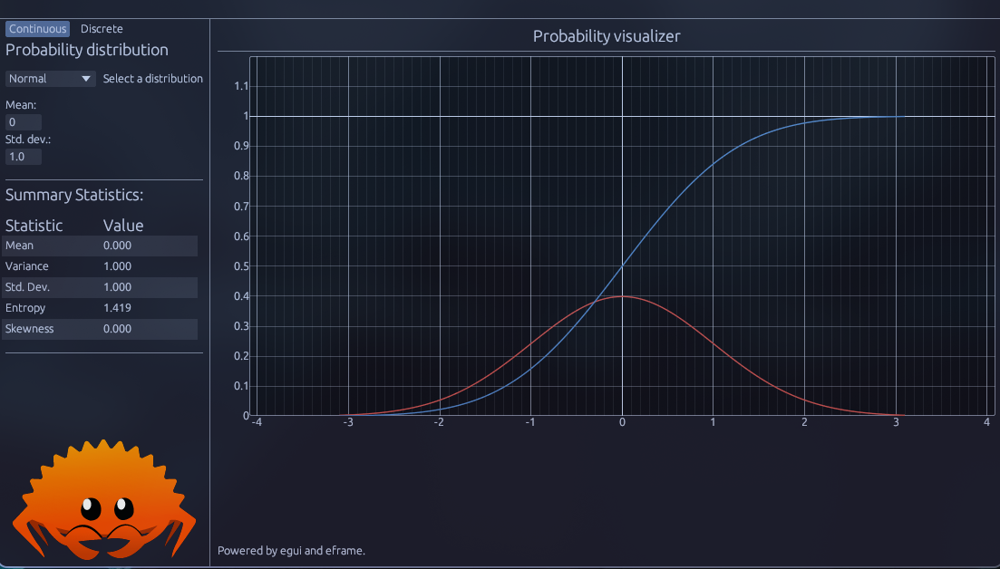

# Probability Visualizer

A interactive application built with `Statrs` and `egui` to visualize various continuous and discrete probability distributions. Users can select a distribution, adjust its parameters using sliders or drag values, and view the corresponding Probability Density Function (PDF)/ Probability Mass Function (PMF) and the Cumulative Distribution Function (CDF). Summary statistics for the selected distribution are also displayed.

A live demo compiled in WASM is available [here](https://jbiccler.github.io/probability_visualizer/).



## Features

*   Visualize common continuous and discrete probability distributions.
*   Adjust distribution parameters dynamically.
*   See key summary statistics (mean, variance, standard deviation, entropy, skewness).
*   Built with `egui` for a cross-platform graphical user interface (native and WebAssembly).

## Building and Running

This project requires the Rust toolchain (rustup) and Cargo. For the web version, Trunk is also required.

### Prerequisites

*   [Rust and Cargo](https://rustup.rs/)
*   For web deployment/development: [Trunk](https://trunkrs.dev/) (`cargo install trunk`)

### Native

To build and run the native desktop application:

```/dev/null/terminal
cargo run
```

### WebAssembly (Web)

To build the WebAssembly version and serve it locally using Trunk:

```/dev/null/terminal
trunk serve --release
```

This will build the project and start a local web server, usually at `http://127.0.0.1:8081` (or the port specified in `Trunk.toml`).

## Deployment

The project includes a GitHub Actions workflow (`.github/workflows/pages.yml`) to automatically build and deploy the WebAssembly version to GitHub Pages on pushes to the `main` branch.
